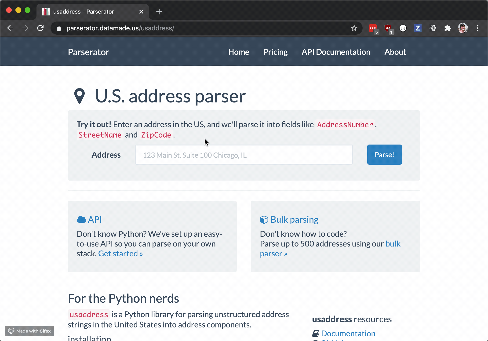

# DataMade Code Challenge: Parserator

Welcome to the DataMade code challenge! 👋

Your task is to recreate the **address parsing form** in DataMade's
[Parserator](https://parserator.datamade.us) web service. Parserator can take
input strings that represent addresses (like `123 main st chicago il`)
and split them up into their component parts:



In this repo, we've provided the code that parses addresses, as well as the basic scaffolding
of the templates, views, and routes that comprise the app. You'll need to flesh out
certain code blocks in the frontend and backend code in order to send API requests,
process them on the server, and display the results to the user.

To get started, fork this repo and follow the instructions below.

## Installation

Development requires a local installation of [Docker](https://docs.docker.com/install/)
and [Docker Compose](https://docs.docker.com/compose/install/). These are the
only two system-level dependencies you should need.

Once you have Docker and Docker Compose installed, build the application containers:

```
docker-compose build
```

Next, run the app:

```
docker-compose up
```

The app will log to the console, and you should be able to visit it at http://localhost:8000.

## Completing the challenge

Once you have the app up and running on your computer, you'll need to flesh out
certain code blocks to complete the parsing interface. Make sure to create a new
feature branch for your work before you begin.

### Step 1: Complete the parsing API endpoint

In `parserator_web/views.py`, complete the `AddressParse.get()` method to return
three pieces of data:

- `input_string`: The string that the user sent
- `address_components`: A dictionary of parsed components that comprise the address,
   in the format `{address_part: tag}` (returned by `AddressParse.parse()`)
- `address_type`: A string representing type of the parsed address (returned by `AddressParse.parse()`)

```python
class AddressParse(APIView):
    renderer_classes = [JSONRenderer]

    def get(self, request):
        # TODO: Flesh out this method to parse an address string using the
        # parse() method and return the parsed components to the frontend.
        return Response({})
```

### Step 2: Wire up the form to send requests to the API

In `parserator_web/templates/parserator_web/index.html`, fill out the `<script>`
tag in the `extra_js` block, adding JavaScript code that will use the form
to send form data to the API endpoint fleshed out in step 1.

```html

  <script type="text/javascript">
    /* TODO: Flesh this out to connect the form to the API. */
  </script>

```

### Step 3: Display results from the API

In `parserator_web/templates/parserator_web/index.html`, extend the `<script>`
tag in the `extra_js` block to display results from the API endpoint in the
hidden element `<div id="address-results">`.

Make sure that if the API raises an error (as it will for the string
`123 main st chicago il 123 main st`, which contains a repeated label that
`AddressParse.parse()` cannot parse) it displays this error to the user.

```html
<!-- TODO: Display parsed address components here -->
<div id="address-results" style="display:none">
  <h4>Parsing results</h4>
  <p>Address type: <strong><span id="parse-type"></span></strong></p>
  <table class="table table-bordered">
    <thead>
      <tr>
        <th>Address part</th>
        <th>Tag</th>
      </tr>
    </thead>
    <tbody>
    </tbody>
  </table>
</div>
```

### Step 4: Add unit tests

_TK: Is this too much?_

### Step 5: Submit your work

To submit your work, create a feature branch for your code, commit your changes,
push your commits up to your fork, and open up a pull request against `master`.
Finally, drop a link to your pull request in your application.  
